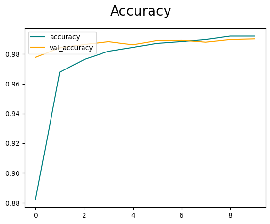
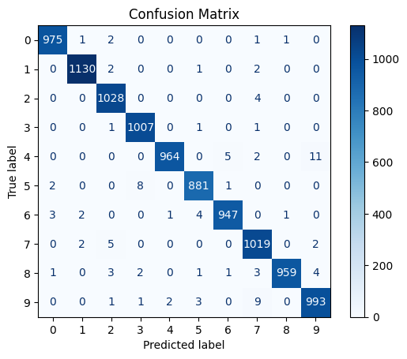

# MNIST Image Classifier

This repository contains a set of deep learning experiments for image classification, centered on the MNIST handwritten digit dataset and extended with a small custom image classification workflow. The project uses convolutional neural networks (CNNs) built in TensorFlow/Keras to train, evaluate, and visualize image classifiers.

## Project Scope

The repository currently includes two main tracks:

1. **MNIST digit classification**
   - CNN-based handwritten digit classification on the standard MNIST dataset
   - model training, evaluation, and visualization
   - accuracy and confusion-matrix outputs

2. **Custom image classification**
   - experiments on a folder-based custom dataset under `data/`
   - binary classification using the `happy` and `sad` classes
   - notebook-based experimentation for applying CNNs beyond MNIST

## Repository Structure

```text
MNIST-ImageClassifier/
├── data/
│   ├── happy/
│   └── sad/
├── cnn_dev.ipynb
├── cnn_mnist.ipynb
├── Custom_Image_Classifier.ipynb
├── Deep CNN Image Classifier (Any Images).ipynb
├── multiclassifier_and_binary_classifier.ipynb
├── output.png
├── output3.png
├── happy.zip
├── sad.zip
└── .gitignore
```

## Notebook Overview

### `cnn_mnist.ipynb`
Core MNIST notebook. It loads the MNIST dataset from `tensorflow.keras.datasets`, reshapes and normalizes the images, trains a CNN, and visualizes performance.

### `cnn_dev.ipynb`
Development notebook for MNIST experimentation. It includes model training and visualization work and appears to have been used for iterative testing and improvement.

### `Custom_Image_Classifier.ipynb`
Custom CNN-based image classification notebook. It uses Keras/TensorFlow and is aimed at classifying non-MNIST images with a multi-class or custom pipeline structure.

### `Deep CNN Image Classifier (Any Images).ipynb`
Folder-based custom image classifier notebook. It reads image data from the local `data/` directory and is suited to experiments on arbitrary image folders such as the included `happy/` and `sad/` sets.

### `multiclassifier_and_binary_classifier.ipynb`
An additional experimental notebook. It appears to contain broader classification experimentation and may not be part of the main MNIST workflow.

## Dataset

### MNIST
The MNIST portion of the project uses the built-in TensorFlow/Keras dataset:

- 28×28 grayscale handwritten digits
- labels `0` to `9`
- standard train/test split

### Custom Dataset
The `data/` folder contains two custom classes:

- `happy`
- `sad`

These images are used for binary image classification experiments outside the MNIST task.

## Model Workflow

The main CNN-based workflow used in the project follows this general pattern:

1. Load the dataset
2. Reshape image tensors for CNN input
3. Normalize pixel values
4. Define a CNN architecture
5. Train the model
6. Evaluate on held-out test data
7. Visualize performance using accuracy curves and a confusion matrix

## Diagrams and Outputs

### Training Accuracy

The repository already contains a training/validation accuracy plot:



This figure shows the learning progression of the model across epochs, including both training accuracy and validation accuracy.

### Confusion Matrix

The repository also contains a confusion matrix for digit classification:



This matrix summarizes classification performance across the ten MNIST digit classes and helps identify which digits are most frequently confused by the model.

## Requirements

The notebooks indicate that the project uses the following core libraries:

- Python 3.x
- TensorFlow / Keras
- NumPy
- Matplotlib
- OpenCV (`cv2`)
- scikit-learn

Depending on the notebook, you may also need:

- seaborn
- pyspark
- Jupyter Notebook or JupyterLab

## Running the Project

Because this repository is notebook-based, the easiest way to use it is through Jupyter.

### 1. Create and activate a virtual environment

```powershell
python -m venv .venv
.venv\Scripts\Activate.ps1
```

### 2. Install dependencies

```powershell
pip install tensorflow matplotlib numpy scikit-learn opencv-python jupyter seaborn
```

If you want to run all notebooks exactly as written, you may also need:

```powershell
pip install pyspark
```

### 3. Launch Jupyter

```powershell
jupyter notebook
```

Then open one of the notebooks, for example:

- `cnn_mnist.ipynb`
- `cnn_dev.ipynb`
- `Deep CNN Image Classifier (Any Images).ipynb`

## Suggested Entry Points

If you are new to the repository, start with:

1. `cnn_mnist.ipynb` for the main MNIST workflow
2. `cnn_dev.ipynb` for additional model experimentation
3. `Deep CNN Image Classifier (Any Images).ipynb` for custom folder-based image classification

## Notes

- The repository is currently notebook-centric rather than package-structured.
- Some notebooks appear exploratory and may contain experimental or Colab-specific code.
- The custom image dataset is separate from the MNIST digit dataset.
- The included PNG files are useful report-ready visual outputs for model evaluation.

## Future Improvements

Possible next improvements for this project include:

- moving reusable code from notebooks into Python modules
- adding a `requirements.txt`
- documenting model architectures and hyperparameters explicitly
- saving trained models in a dedicated `models/` directory
- adding a script-based training and evaluation pipeline

